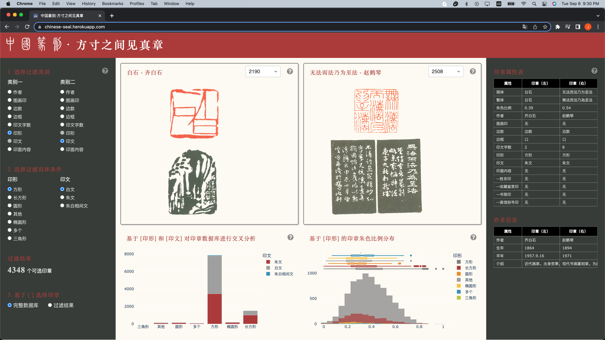
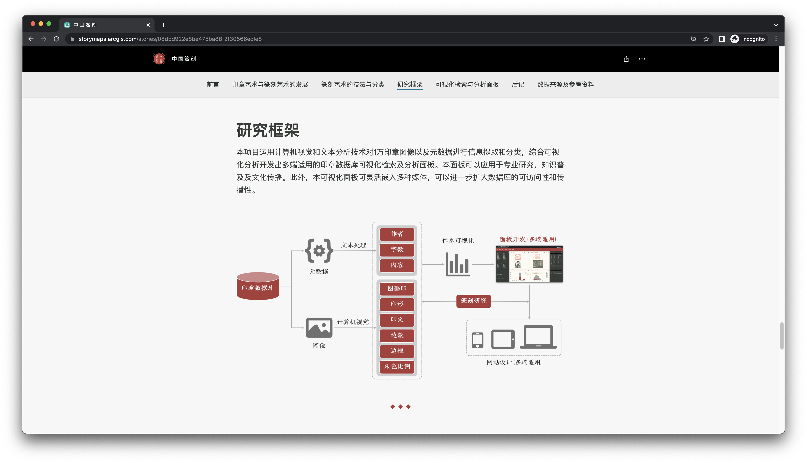
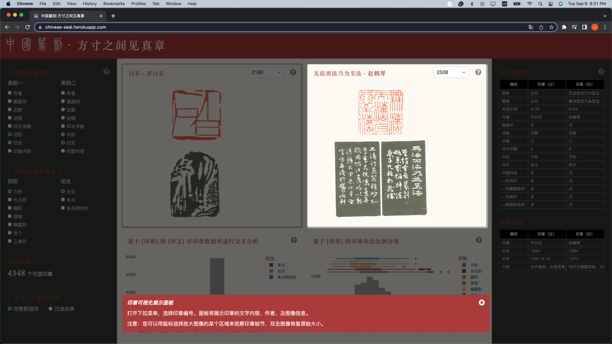
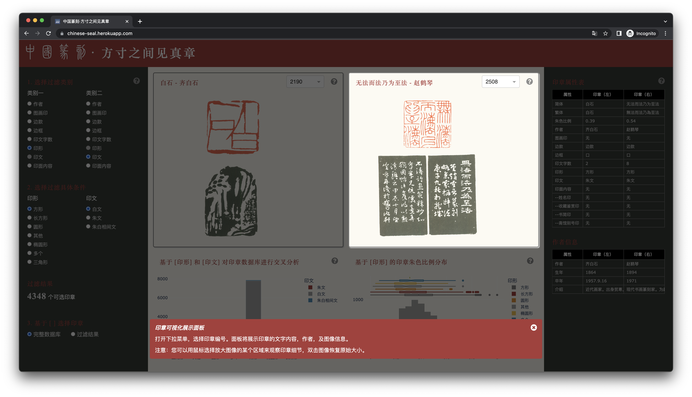

# Art of Chinese Seal Engraving

Shanghai Library Open Data Contest

**Author**: Jingrong Zhang (张镜荣)

**Data sourse**: Shanghai Library, http://opendata.library.sh.cn/

**Development Tools**: Python Plotly, Dash, JS/CSS, Esri StoryMaps

**Project Website Link**: https://arcg.is/CiqKr

**Dashboard Online Link**: https://chinese-seal.herokuapp.com/ 

### Screenshots









**How To Run Locally** : 

To install all of the required packages to this environment, run:

```python
pip install -r requirements.txt
```

Run this app locally by:

```python
python app.py
```

